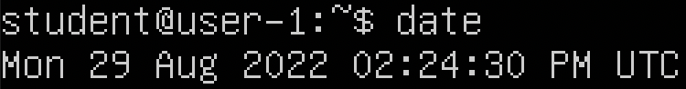
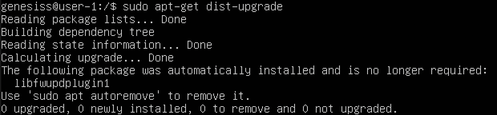
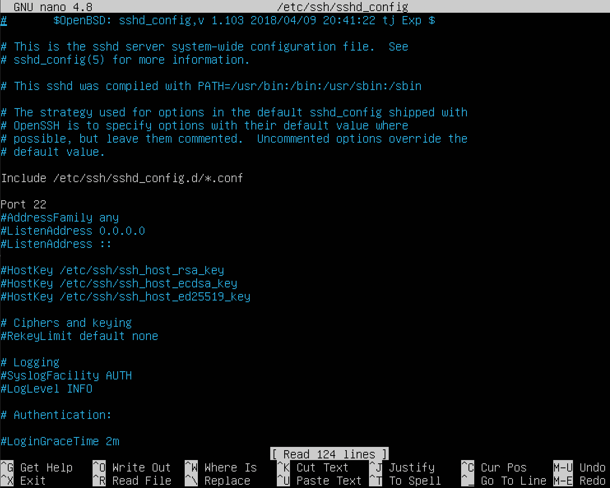
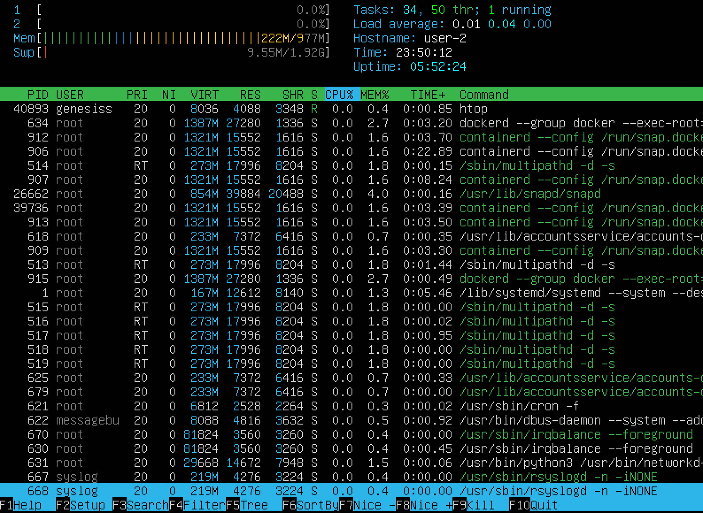
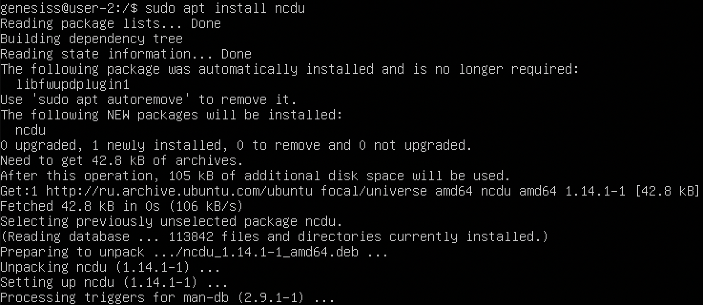
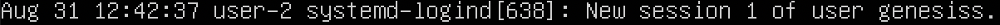
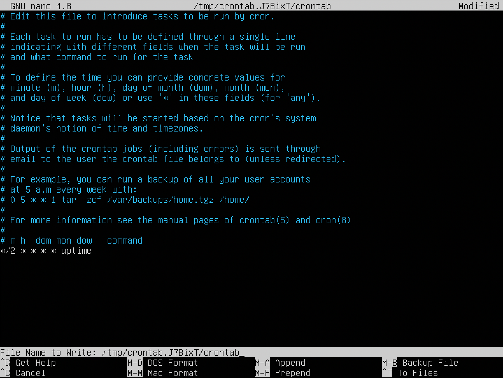
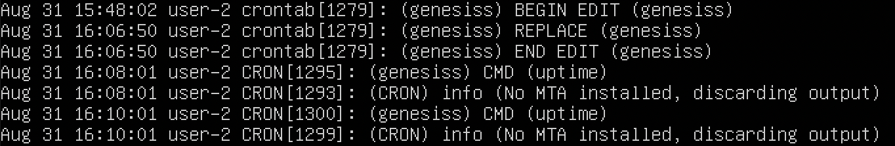

## Part 1. Установка ОС

> *Узнаем версию* Ubuntu, выполнив команду: `cat /etc/issue` .

## Part 2. Создание пользователя

> Основная пользовательская информация находится в файле ` /etc/passwd ` .
> Это текстовый файл, который содержит важную информацию о каждом пользователе.

> Когда мы создаем нового пользователя, новые данные пользователя будут добавлены в этот файл. При создании новых пользователей следующие четыре файла будут изменены:
> - ` /etc/passwd ` : информация о пользователе будет обновлена ​​в этом файле.
> - ` /etc/shadow `: информация о пароле пользователя будет обновлена ​​в этом файле.
> - ` /etc/group `: информация о группе будет обновлена ​​для нового пользователя в этом файле.
> - ` /etc/gshadow `: информация о пароле группы будет обновлена ​​для нового пользователя в файле.

> Создать пользователя можно с помощью одной из трёх следующих команд:
> - ` useradd `: создать нового пользователя или обновить информацию о новом пользователе по умолчанию.
> - ` adduser `: создать нового пользователя со всеми параметрами по умолчанию или обновить информацию о новом пользователе.
> - ` newusers `: обновить и создать новых пользователей в пакетном режиме.

> Удалить пользователя можно с помощью следующей команды: ` sudo deluser username ` .

> Создаем нового пользователя с помощью команды: ` sudo useradd -s /bin/bash genesiss ` .

> Проверяем информацию о пользователе с помощью команды: ` cat /etc/passwd ` .
> Можно проверить с использованием grep командой: ` cat /etc/passwd | grep genesiss ` .

> Создаём пароль для пользователя genesiss: ` sudo passwd genesiss ` .

> Добавляем пользователя в группы adm и sudo для предоставления прав на прочтение логов из папки /var/log: ` sudo usermod -G adm,sudo genesiss ` .

## Part 3. Настройка сети ОС

Сначала следует прочесть про сетевые интерфейсы и [DHCP](https://selectel.ru/blog/dhcp-protocol/ "Принципы работы протокола DHCP"). Также можно прочитать информацию

> Какие порты использует DHCP? Сервер всегда слушает **67 порт**, ожидает широковещательное сообщение от клиента, а после его получения отправляет ответное предложение — DHCPOFFER. Клиент принимает сообщение на **68 порту**.

> ` hostname ` — это имя, которое присваивается компьютеру, подключенному к сети, которое однозначно идентифицирует в сети и, таким образом, позволяет получить доступ к нему без использования его IP-адреса.

> Чтобы проверить какое имя хоста установлено, можно воспользоваться командой: ` hostname ` .

> Задаем название машины вида *user-1* с помощью команды: ` sudo hostname user-1 ` .(изменения действуют до первой перезагрузки)

> Чтобы изменить имя навсегда, используем команду: ` sudo hostnamectl set-hostname user-1 ` .

> После перезагрузки VirtualBox.

> Проверяем какая временная зона установлена с помощью команды: ` date ` .

> Выводим все виды времени: ` timedatectl ` .

> Определяем временную зону: ` timedatectl list-timezones ` . 

> Для установки нужной временной зоны вводим команду: ` sudo timedatectl set-timezone Asia/Novosibirsk ` .

> Для вывода названия сетевых интерфейсов используем команду: ` ifconfig ` . Однако эта команда уже считатется устаревшей и далее рекомендуется применять команду: ` ip address ` или ` ip addr ` или ` ip a `. О том как узнать ip-адрес можно прочитать в [статье](https://pingvinus.ru/note/determine-ip-address "Как узнать ip-адрес.").

> Интерфейс lo (loopback device) - это виртуальный интерфейс, присутствующий по умолчанию в любом Linux. Он используется для отладки сетевых программ и запуска серверных приложений на локальной машине. С этим интерфейсом всегда связан адрес 127.0.0.1. С помощью данного адреса программы могут обмениваться трафиком. У него есть dns-имя – localhost. Посмотреть привязку можно в файле /etc/hosts.
> Вывод с помощью другой команды: ` ip link show ` .

> Используя консольную команду ` hostname -I ` получаем ip адрес устройства, на котором работаем, от DHCP сервера. DHCP - это сетевой протокол, используемый для автоматического получения узлами IP-адресов и сетевой конфигурации с сервера. Для просмотра IP-адресов также можно использовать команду: ` ip r ` или ` ip route ` .

> внешний ip-адрес шлюза (ip) ` 10.0.2.15 `, внутренний IP-адрес шлюза, он же ip-адрес по умолчанию (gw) ` 10.0.2.2 `, вывод возможен с помощью команды: ` ip route | grep default ` .

> Можно использовать опцию ` -n ` с командой ` route ` для отображения таблицы маршрутизации с IP-адресами. Флаги U означает, что маршрут «вверх», а G означает, что это шлюз.

> [Для ручной настройки](https://help.ubuntu.ru/wiki/%D0%BD%D0%B0%D1%81%D1%82%D1%80%D0%BE%D0%B9%D0%BA%D0%B0_%D1%81%D0%B5%D1%82%D0%B8_%D0%B2%D1%80%D1%83%D1%87%D0%BD%D1%83%D1%8E "Настройка сети вручную") проверяем подключённые сетевые устройства. Для настроек обязательно потребуется имя сетевого адаптера. Его можно узнать из вывода команды: ` sudo lshw -C network ` . Она позволяет посмотреть подключенные сетевые устройства.

Перед дальнейшей работой следует ознакомиться со статьями ([первая](https://losst.ru/spisok-setevyh-interfejsov-linux), [вторая](https://losst.ru/nastrojka-seti-iz-konsoli-ubuntu)).

> Используем команду ` sudo nano /etc/netplan/00-installer-config.yaml ` для установки статического адреса. Меняем 

> на

> Сохраняем изменения в файле Ctrl+X, выполняем команду ` sudo netplan apply ` .
> Проверяем установленные настройки: ` ip r ` .

> Проверяем установленные настройки dns: `systemd-resolve --status` .

> Пинугем по 5 раз удаленные хосты 1.1.1.1: ` ping -c 5 1.1.1.1` . ya.ru: ` ping -c 5 ya.ru ` .

## Part 4. Обновление ОС

> До обновления системных пакетов до последней версии используем команду, которая обновит информацию о пакетах, содержащихся в репозиториях для получения самых последних версий пакетов: ` sudo apt-get update` .

> Обновляем версию с помощью команды: ` sudo apt-get dist-upgrade ` . В процессе обновления необходимо будет подтвердить обновление.

> Повторный вызов команды покажет, что нечего обновлять.

## Part 5. Использование команды sudo

Про то как разрешить пользователю выполнять команду sudo, можно прочитать в этой [статье](https://1cloud.ru/help/linux/nastrojka-prav-polzovatelej-na-ubuntu "Разграничение прав пользователей в Ubuntu").

> Команда ` sudo ` (англ. **S**ubstitute **U**ser and **DO**, дословно «подменить пользователя и выполнить») позволяет пользователям выполнять указанные программы с привилегиями суперпользователя, без введения пароля суперпользователя (root). Если быть точнее, то команда sudo позволяет выполнять программы от имени любого пользователя, но, если идентификатор или имя этого пользователя не указаны, то предполагается выполнение от имени суперпользователя root. Таким образом, использование sudo позволяет выполнять привилегированные команды обычным пользователям без необходимости ввода пароля суперпользователя root. Более подробно можно прочитать в [описании команды](https://white55.ru/sudo.html "man sudo").

> Для переключения на созданного пользователя используется команда: ` su genesiss ` .

> Добавление пользователя в группу, которая позволяет пользователю применять команду sudo: ` sudo usermod -a -G sudo genesiss ` .

> Меняем hostname от имени созданного пользователя, которому дали права sudo

## Part 6. Установка и настройка службы времени

> В этой части настроивается служба автоматической синхронизации времени.

> Посмотреть какое время установлено возможно введя команду: ` date ` .

> Команда ` timedatectl show ` выведет более подробную информацию о времени и дате.

## Part 7. Установка и использование текстовых редакторов

> Для работы с редактором **MCEDIT** потребуется его установка. Установить его можно с помощью команды: ` sudo apt -y install mc ` .

> Создать файл можно с помощью команды: `touch filename.txt ` ,
> где ` filename.txt ` - имя файла с расширением. 

---

> Для работы в тестовом редакторе **VIM** используем команду: ` sudo vim test_vim.txt ` .

> Чтобы начать ввод текста в vim, необходимо нажать ` i ` *-insert-*. После завершения ввода текста, необходимо нажать клавишу ` esc `, чтобы выйти из режима *-insert-*.
> Для сохранения изменений и выхода из vim необходимо ввести: ` :wq ` .

> Открываем файл, вносим изменения и выходим без сохранения: ` :q! ` .

> Для поиска слов в редакторе vim по файлу используем команду:  ` /searchname ` .

> Для замены найденного слова используем команду: ` %s/searchname/replacename/g ` . Символ ` % ` означает что обрабатывать нужно весь файл, а ` g ` значит, что нужно обработать все найденные строки, а не только первую. Чтобы программа спрашивала перед каждой заменой можно добавить в конец строки опцию ` c `.

---

> Для начала работы с файлом *test_nano.txt* в текстовом редакторе **NANO** используется команда ` sudo nano test_nano.txt `. После изменения файла, сохранить его можно (без запроса на сохранение) нажав сочетание клавиш  ` Ctrl + "O" ` . Выйти с запросом на сохранение, можно с помощью сочетания клавиш ` Ctrl + "X" `. Если изменения не были сохранены, при выходе программа предложит сохранить данные.

> Снова открываем файл, редактируем, но выходим без сохранения ` Ctrl+X `.

> Команда ` Ctrl + W ` используется для поиска слов в редакторе. Курсор переместится на первое вхождение (относительно курсора) искомого текста, чтобы продолжить поиск, нажмите сочетание клавиш ` Alt + W ` или ` option + W ` и курсор переместится к следующему вхождению.

> Замена найденного слова возможна с помощью ` Ctrl+\ ` .

---

> Для начала работы с файлом *test_mcedit.txt* в текстовом редакторе **MCEDIT** используется команда ` sudo mcedit test_mcedit.txt `. 
> Для сохранения быстро нажимаем по очереди ` ESC ` потом ` 2 ` выбираем "Save", либо сохранить при выходе из редактора ` ESC ` потом ` 0 ` .

 

> Снова заходим в редактор, вносим изменения, выходим без сохранения ` ESC ` потом ` 0 ` . Выбираем "No".

> Поиск в редакторе осуществляется с помощью ` ESC ` потом ` 7 ` .

> Замена слова в редакторе осуществляется с помощью ` ESC ` потом ` 4 ` .

## Part 8. Установка и базовая настройка сервиса SSHD

> Для начала работы устанавливаем ` ssh ` . Для его установки используется команда ` sudo apt install ssh ` .
Далее выполняем следующую команду ` sudo apt install openssh-server `, чтобы установить SSH-сервер в системе Ubuntu.

> После завершения загрузки и установки пакета служба SSH должна быть уже запущена, но для уверенности мы проверим ее с помощью ` service ssh status ` либо ` sudo systemctl status ssh ` .

> Добавить сервис в автозагрузку можно с помощью опции enable ` sudo systemctl enable ssh ` .

 
> Проверяем изменения ` systemctl is-enabled sshd `

> Чтобы изменить порт открываем файл ` sudo nano /etc/ssh/sshd_config ` и меняем номер порта на **2022**

> Перезапускаем службу с помощью команды ` sudo systemctl restart sshd `. Порт изменился на 2022. 

> Проверяем наличие процесса sshd с помощью команды ` ps -ef | grep sshd`. 
>  ` е ` выводит информацию обо всех активных процессах. По умолчанию выводится 4 столбца PID, TTY, Time, Command. 
> ` f ` выводит больше информации о запущенных процессах:
> * UID - *пользователь, от имени которого запущен процесс*;
> * PID - *идентификатор процесса*;
> * PPID - *идентификатор родительского процесса*;
> * C - *процент времени CPU, используемого процессом*;
> * STIME - *время запуска процесса*;
> * TTY - *терминал, из которого запущен процесс*;
> * TIME - *общее время процессора, затраченное на выполнение процессора*;
> * CMD - *команда запуска процессора*;

> Утилита ` grep ` помогает фильтровать результаты из команды ps. 

> Инструмент ` netstat ` используется для вывода сведений о сетевых соединениях и таблицах маршрутизации, данных о работе сетевых интерфейсов, о masquerade-соединениях, об элементах групп многоадресной рассылки. 
> ` a (all) ` - для вывода сведений обо всех портах и соединениях, вне зависимости от их состояния и от используемого протокола. 
> ` t (tcp) ` - для вывода сведений обо всех TCP-портах. 
> ` n (numeric)` - выводит числовые адреса, не пытаясь определить символьное имя узла, порт или имя пользователя (запрещает использование псевдонима).

> * Proto: *Протокол (tcp, udp, raw), используемый сокетом*;
> * recv-Q: *Счётчик байт, не скопированных программой пользователя из этого сокета*;
> * send-Q: *Счётчик байтов, не подтверждённых удалённым узлом*;
> * Local address: *Адрес и номер порта локального конца сокета. Если не указана опция --numeric (-n), адрес сокета преобразуется в каноническое имя узла (FQDN), и номер порта преобразуется в соответствующее имя службы*;
> * Foreign address: *Адрес и номер порта удалённого конца сокета. Аналогично "Local Address"*, 0.0.0.0:* - означает, что процесс привязан ко всем интерфейсам*.

## Part 9. Установка и использование утилит top, htop

> По выводу команды ` top `:
> * uptime **5:01**
> * количество авторизованных пользователей **1 user** 
> * общая загрузка системы **0.00, 0.01, 0.00**
> * общее количество процессов **117** 
> * загрузка cpu **0.0 us**
> * загрузка памяти **221 mb**
> * pid процесса занимающего больше всего памяти **634 (2.7%)**
> * pid процесса, занимающего больше всего процессорного времени **1**

> Выход осуществляется по команде ` q `

> Команда ` htop ` выполняет примерно ту же задачу, что и top, но имеет определённые преимущества и недостатки: более удобные поиск и фильтрация, но менее гибкая настройка отображения процессов. Выбор варианта сортировки ввыполняется после нажатия клавиши ` F6 `.

> * сортировка по ` PID `:

> * сортировка по ` PERCENT_CPU `:

> * сортировка по ` PERCENT_MEM `:

> * сортировка по ` TIME `:

> * фильтр для процесса *sshd* (после нажатия ` \ ` в строке *Filter* ввести *sshd*):

> * с процессом *syslog*, найденным, используя поиск (` F3 `):

> * с добавленным выводом *hostname*, *clock* и *uptime* (через настройки ` F2 ` добавляем нужные пункты):

## Part 10. Использование утилиты fdisk

> Запускаем команду ` sudo fdisk -l /dev/sda `(` fdisk -l ` отображает все доступные диски).
> * название жесткого диска **/dev/sda**;
> * его размер **16 GiB (17179869184 bytes)**;
> * количество секторов **33554432 sectors**;

> Запускаем команду ` swapon --show ` .
> * swap (**1.9G**) - область на жестком диске, которая используется для временного хранения данных из оперативной памяти, для которых там больше нет места.

## Part 11. Использование утилиты df

Прочитать man по утилите df можно в этой [статье](https://www.opennet.ru/man.shtml?topic=df&category=1&russian=2 "man df").

> Запускаем команду ` df ` . Эта команда позволяет получить подробный отчёт об использовании дискового пространства системы. 

> Информация о корневом разделе (указывается в колонке *Mounted on* как ` / `):
> * размер раздела **16400252**
> * размер занятого пространства **6313176**
> * размер свободного пространства **9231988**
> * процент использования **41%**
> * единица измерения в выводе **kB**

> Запускаем команду ` df -Th` . Эта команда позволяет выводить тип системы и данные в удобочитаемом виде для человека.
> - ` -T ` (--print-type) - вывести тип файловой системы;
> - ` -h ` (--human-readable) - вывести размеры в удобочитаемом виде.

> Для корневого раздела (/):
> * размер раздела **16G**
> * размер занятого пространства **6.1G**
> * размер свободного пространства **8.9G**
> * процент использования **41%**
> * тип файловой системы для раздела **ext4**

## Part 12. Использование утилиты du

> Для получения информации о приблизительном объёме дискового пространства, используемого указанными при вызове командами, файлами или каталогами, используем команду ` du `. У этой команды есть опции, но опишем только несколько из них:
> - ` -s ` - вывод общего размера папки; 
> - ` -h ` - для вывода в удобочитаемом виде;
> - Для вывода информации о папке необходимо прописать путь к ней.

> Выводим размер папок /home:

> Выводим размер папок /var:
 

> Выводим размер папок /var/log:

> 

> Для того чтобы вывести размер всего содержимого в каталоге ` /var/log `, используется команда: ` sudo du -ha /var/log/* ` .
> - ` -a ` - используется, если надо выводить размер не только папок, но и файлов, которые там находятся.

## Part 13. Установка и использование утилиты ncdu 

> Для работы с утилитой необходимо ее установить с помощью команды: ` sudo apt install ncdu ` . Команда ` ncdu ` имеет то же назначение, что и du, но обладает более удобным интерфейсом. Для выхода из утилиты ` ncdu `  используется клавиша ` q `.

> Для вывода размера папки /home используем команду: ` ncdu /home ` .

> Для вывода размера папки /var используем команду: ` ncdu /var ` .

> Для вывода размера папки /var/log используем команду: ` ncdu /var/log ` .

## Part 14. Работа с системными журналами 

> Открываем папки с помощью редактора **NANO**.

1. ` sudo nano /var/log/dmesg ` - драйвера устройств. Размер журнала ограничен, когда файл достигнет своего предела, старые сообщения будут перезаписаны более новыми.
 

2. ` sudo nano /var/log/syslog ` содержит глобальный системный журнал, в котором пишутся сообщения с момента запуска системы, от ядра Linux, различных служб, обнаруженных устройствах, сетевых интерфейсов и много другого.

3. ` sudo nano /var/log/auth.log ` - информация об авторизации пользователей, включая удачные и неудачные попытки входа в систему, а также задействованные механизмы аутентификации.

> * Время последней успешной авторизации **12:42:37**.
> * Имя пользователя **genesiss**.
> * Метод входа в систему с паролем **systemd-logind**.

> Перезапускаем службу SSHd командой: ` sudo systemctl restart sshd ` . 

> Находим сообщение о рестарте службы в логах ` /var/log/syslog `

## Part 15. Использование планировщика заданий CRON

Подробнее про утилиту ` cron ` можно почитать в следующих статьях: [первая](https://ru.wikipedia.org/wiki/Cron "Wiki"), [второая](https://habr.com/ru/company/skillfactory/blog/656423/ "Cron — лучшие практики").

> **cron** — классический демон (компьютерная программа в системах класса UNIX), использующийся для периодического выполнения заданий в определённое время. Регулярные действия описываются инструкциями, помещенными в файлы crontab и в специальные каталоги.
> Файлы ` crontab `, создаваемые для отдельных пользователей, находятся в каталоге ` /usr/spool/cron/crontabs/ ` или ` /var/spool/cron/tabs/ `. Редактировать их вручную не рекомендуется, для этого используют команду: ` crontab -e `.
> Файлы crontab, используемые для управления всей системой, располагаются в каталоге ` /etc/cron.d/ `. Кроме того, в каталогах ` /etc/cron.daily/ `, ` /etc/cron.weekly/ ` и ` /etc/cron.monthly/ ` размещаются автоматически запускаемые программы (ежедневно, еженедельно или ежемесячно).
> Основной файл конфигурации cron: ` /etc/crontab `.

> ` uptime ` - утилита в UNIX-подобных системах, показывающая текущее время, время работы после загрузки, количество текущих пользователей в компьютерной системе и нагрузку за последние 1, 5 и 15 минут.

> Создаём задачу для планировщика заданий, чтобы он запускал утилиту ` uptime ` через каждые 2 минуты. Для того чтобы это осуществить, требуется отредактировать или создать файл рассписания для текущего пользователя. После открытия файла, задаем настройки для утилиты *uptime* : ` */2 * * * * uptime ` .

> Редактировать или создать файл рассписания можно с помощью команды: ` crontab -e ` . После введения этой команды откроется следующее окно, его уже можно редактировать.

> Таблица *crontab* состоит из 6 колонок, разделяемых пробелами или табуляторами. Первые пять колонок задают время выполнения (минута, час, день, месяц, день недели), в них может находиться число, список чисел, разделённых запятыми, диапазон чисел, разделённых дефисом, символы * или /. В системных файлах crontab после полей времени указывается пользователь, от которого запускается команда. Все остальные символы в строке интерпретируются как выполняемая команда с её параметрами. Если команда отправляет какой-нибудь текст в стандартный вывод, этот текст отправляется по e-mail пользователю.

> Спустя несколько минут проверяем записи в логах с помощью команды: `cat /var/log/syslog ` .

> Для удаления заданий из планировщика используем команду: ` crontab -r ` . Либо удаеляем задание из предыдущего файла, редактируя его с помощью той же команды: ` crontab -e ` .

